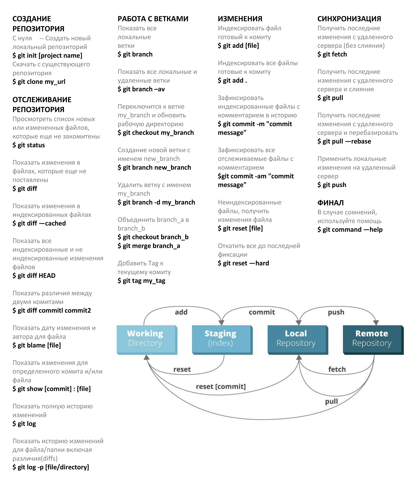

<a align="center">


# Инструкция для работы с Markdown
</a>

### <a name="content">Содержание</a>
---

[Заголовки](#headers)  
[Выделение текста](#Text_Selection)  
[Списки](#lists)  
[Работа с изображениями](#Working_with_images)  
[Ссылки](#links)  
[Работа с таблицами](#Working_with_tables)  
[Цитаты](#blockquotes)  
[Встроенный HTML](#Embedded_HTML)  
[Горизонтальная линия](#Horizontal_lines)  
[Новая строка](#New_line)  
[Видео Youtube](#Youtube_Videos)  
[Заключение](#Conclusion)  

---
## <a name="headers">Заголовки</a>
---

```
# H1
## H2
### H3
#### H4
##### H5
###### H6

Приведем еще пример:

Alt-H1
======

Alt-H2
------

Кроме того, заголовки H1 и H2 можно обозначить подчеркиванием, как представлено выше с начальным префиксом Alt-**
```

# H1
## H2
### H3
#### H4
##### H5
###### H6

Приведем еще пример:

Alt-H1
======

Alt-H2
------

Кроме того, заголовки H1 и H2 можно обозначить подчеркиванием, как представлено выше с начальным префиксом Alt-**

---
## <a name="Text_Selection">Выделение текста</a>
---

Чтобы выделить текст курсивом необходимо оьрамить его звездочками ( * ) или знаком нижнего подчеркивания ( _ ).
Например, *вот так* или _вот так_.

Чтобы выделить текст полужирным, необходимо обрамить его двойными звездлочками ( ** ) или двойным знаком нижнего подчеркивания ( __ ).
Например, **вот так** или __вот так__.

Альтернативные способы выделения текста жирным или курсивом нужны для того, чтобы мы могли совмещать оба этих способа. 
Например, _текст может быть выделен курсивом и при этом быть **полужирным**_.

---
## <a name="lists">Списки</a>
---

Чтобы добавить ненумерованные списки, необходимо пункты выделить зведочкой ( * ) или знаком ( + ). 
Например вот так: 
* Элемент 1
* Элемент 2
* Элемент 3
+ Элемент 4

Чтобы добавить нумерованные списки, необходимо пункты просто пронумеровать. 
Например, вот так:
1. Первый пункт
2. Второй пункт


(В данном примере предшествующие и завершающие пробелы обозначены точками: ⋅)

```
1. Первый пункт нумерованного списка
2. Второй пункт
⋅⋅*Ненумерованный вложенный список.
1. Сами числа не имеют значения, лишь бы это были цифры
⋅⋅1. Нумерованный вложенный список
4. И еще один пункт.

⋅⋅⋅Внутри пунктов списка можно вставить абзацы с таким же отступом. Обратите внимание на пустую строку выше и на пробелы в начале (нужен по меньшей мере один, но здесь мы добавили три, чтобы также выровнять необработанный Markdown).

⋅⋅⋅Чтобы вставить разрыв строки, но не начинать новый параграф, нужно добавить два пробела перед новой строкой.⋅⋅
⋅⋅⋅Этот текст начинается с новой строки, но находится в том же абзаце.⋅⋅
⋅⋅⋅(В некоторых обработчиках, например на Github, пробелы в начале новой строки не нужны.)

* Ненумерованный список можно размечать звездочками
- Или минусами
+ Или плюсами
```

1. Первый пункт нумерованного списка
2. Второй пункт
  * Ненумерованный вложенный список.
1. Сами числа не имеют значения, лишь бы это были цифры
  1. Нумерованный вложенный список
4. И еще один пункт.

   Внутри пунктов списка можно вставить абзацы с таким же отступом. Обратите внимание на пустую строку выше и на пробелы в начале (нужен по меньшей мере один, но здесь мы добавили три, чтобы также выровнять необработанный Markdown).

   Чтобы вставить разрыв строки, но не начинать новый параграф, нужно добавить два пробела перед новой строкой.
   Эта текст начинается с новой строки, но находится в том же абзаце.
   (В некоторых обработчиках, например на Github, пробелы в начале новой строки не нужны.)

* Ненумерованный список можно размечать звездочками
- Или минусами
+ Или плюсами

---
## <a name="Working_with_images">Работа с изображениями</a>
---

Чтобы вставить изображение в текст, достаточно написать следующее:
```

```
В итоге получим следующее:


```
Вот наш логотип (наведите указатель, чтобы увидеть текст заголовка):

Внутри строки:  


В сноске:  
![alt-текст][logo]

[logo]: ../images/icon48.png "Текст заголовка логотипа 2"
```

Вот наш логотип (наведите указатель, чтобы увидеть текст заголовка):

Внутри строки:  


В сноске:  
![alt-текст][logo]

[logo]: ../images/icon48.png "Текст заголовка логотипа 2"


---
## <a name="links">Ссылки</a>
---

Ссылки можно оформить разными способами.

```
[Обычная ссылка в строке](https://www.google.com)

[Обычная ссылка с title](https://www.google.com "Сайт Google")

[Ссылка со сноской][Произвольный регистронезависимый текст]

[Относительная ссылка на документ](../Readme.md)

[Для ссылок со сноской можно использовать цифры][1]

[Для ссылок со сноской можно использовать цифры с сочетанием (1_2)][1_2]

Или можно просто вставить ссылку в квадратные скобки [текст ссылки]

Произвольный текст, после которого можно привести ссылки.

[произвольный регистронезависимый текст]: https://www.mozilla.org
[1]: http://slashdot.org
[1_2]: https://www.yandex.ru
[текст ссылки]: http://www.reddit.com
```

[Обычная ссылка в строке](https://www.google.com)

[Обычная ссылка с title](https://www.google.com "Сайт Google")

[Ссылка со сноской][Произвольный регистронезависимый текст] *

[Относительная ссылка на документ](../Readme.md)

[Для ссылок со сноской можно использовать цифры][1]

[Для ссылок со сноской можно использовать цифры с сочетанием (1_2)][1_2]

Или можно просто вставить ссылку в квадратные скобки [текст ссылки]

Произвольный текст, после которого можно привести ссылки.

[Произвольный регистронезависимый текст]: https://www.mozilla.org
[1]: http://slashdot.org
[1_2]: https://www.yandex.ru
[текст ссылки]: http://www.reddit.com

(*) Для символов не входящих в ASCII, например кириллицы, текст сноски все-таки регистрозависим (прим. перев.)

---
## <a name="Working_with_tables">Работа с таблицами</a>
 ---

Таблицы не являются частью Markdown, но обработчик, например Github, поддерживает их. Они позволяют легко добавить таблицы в электронное письмо -- в других случаях для этого нужно копировать их из другого приложения.

```
Вертикальные линии обозначают столбцы.

| Таблицы       | Это                | Вот так |
| ------------- |:------------------:| -------:|
| столбец 3     | выровнен вправо    |  $1600  |
| столбец 2     | выровнен по центру |    $12  |
| зебра-строки  | прикольные         |     $1  |
```

Вертикальные линии обозначают столбцы.

| Таблицы       | Это                | Вот так |
| ------------- |:------------------:| -------:|
| столбец 3     | выровнен вправо    |  $1600  |
| столбец 2     | выровнен по центру |    $12  |
| зебра-строки  | прикольные         |     $1  |


_**Но...**_

```
Внешние вертикальные линии ( | ) не обязательны и нужны только, чтобы сам код Markdown выглядел красиво. Тот же код можно записать так:

Markdown | не такой | красивый
--- | --- | ---
*Но выводится* | `так же` | **классно**
1 | 2 | 3
```

Внешние вертикальные линии ( | ) не обязательны и нужны только, чтобы сам код Markdown выглядел красиво. Тот же код можно записать так:

Markdown | не такой | красивый
--- | --- | ---
*Но выводится* | `так же` | **классно**
1 | 2 | 3

---
## <a name="blockquotes">Цитаты</a>
---

Ниже разберем, как делается цитата в Markdown:
```
> С помощью цитат очень удобно в письме обозначать исходный текст.
> Эта строка - часть той же цитаты.

_**Разрыв цитаты для примера**_.

> Это очень длинная строка, но она будет правильно процитирована даже при размещении на нескольких строках. Продолжаем писать, чтобы эта строка не вмещалась на одной строке в любом окне. Кстати, в цитаты можно *вставлять* даже **Markdown**.
```

> С помощью цитат очень удобно в письме обозначать исходный текст.
> Эта строка - часть той же цитаты.

_**Разрыв цитаты для примера**_.

> Это очень длинная строка, но она будет правильно процитирована даже при размещении на нескольких строках. Продолжаем писать, чтобы эта строка не вмещалась на одной строке в любом окне. _**Кстати**_, в цитаты можно также *размечать* с помощью **Markdown**.

---
## <a name="Embedded_HTML">Встроенный HTML</a>
---

Часто Markdown понимает чистый HTML.

```
<dl>
  <dt>Список определений</dt>
  <dd>Это то, что люди иногда используют.</dd>

  <dt>Markdown внутри HTML</dt>
  <dd>Работает **не очень** хорошо. Используйте HTML-<em>теги</em>.</dd>
</dl>
```

<dl>
  <dt>Список определений</dt>
  <dd>Это то, что люди иногда используют.</dd>

  <dt>Markdown внутри HTML</dt>
  <dd>Работает **не очень** хорошо. Используйте HTML-<em>теги</em>.</dd>
</dl>

---
## <a name="Horizontal_lines">Горизонтальные линии</a>
---

Ниже разберем самое простое, но _**нужное**_ для понимания и не менее __*полезное*__:

```
Три и более...

---

Дефисы

***

Звездочки

___

Подчеркивания
```

Три и более...

---

Дефисы

***

Звездочки

___

Подчеркивания

---
## <a name="New_line">Новая строка</a>
---

Для понимания работы разрыва строка автор главным образом рекомендует экспериментировать и пробовать -- нажмите &lt;Enter&gt; один раз (т.е. перейдите на новую строку), потом нажмите дважды (т.е. вставьте две новые строки) и посмотрите что приозошло. Вы сразу поймете что вам нужно. В расширении [Markdown Here](https://github.com/adam-p/markdown-here) для браузеров есть удобная функция "Markdown Toggle", которая поможет в этом.

*Примечание переводчика:*  
*Для переноса на новую строку в конце предыдущей строки необходимо добавить* **два пробела**. *Без этого большинство парсеров Markdown не выполняют переход на новую строку.*

Попробуйте ввести следующее:

```
Это начальная строка

Эта строка отделена от предыдущей двумя новыми строками и станет *отдельным абзацем*.

Это тоже отдельный абзац, но...⋅⋅
Эта строка отделена одной новой строкой, поэтому она находится в *том же абзаце*.
```

Это начальная строка

Эта строка отделена от предыдущей двумя новыми строками и станет *отдельным абзацем*.

Это тоже отдельный абзац, но...`[здесь два пробела]`  
Эта строка отделена одной новой строкой, поэтому она находится в *том же абзаце*.  

(Примечание: В [Markdown Here](https://github.com/adam-p/markdown-here) разрывы строк ведут себя так же, как в [GFM](https://help.github.com/articles/github-flavored-markdown), поэтому не нужно вставлять по две новые строки.)

---
## <a name="Youtube_Videos">Видео Youtube</a>
---

Ролики нельзя вставить напрямую, но можно вставить изображение со ссылкой на видео, например:

```
<a href="https://www.youtube.com/watch?v=ux6zXguiqxM" target="_blank"></a>
```

<a href="https://www.youtube.com/watch?v=ux6zXguiqxM" target="_blank"></a>

На чистом Markdown, но без размеров изображения и рамки:

```
[](https://www.youtube.com/watch?v=ux6zXguiqxM)
```

[](https://www.youtube.com/watch?v=ux6zXguiqxM)

---
## <a name="Conclusion">Заключение</a>
---
* Спасибо за внимание!
- Инструкция написана в ознакомительных целях, также она предназначена для людей, которые решили изучить Markdown (и меня, как шпаргалка). 
+ Для удобства можно перейти в раздел с [Содержанием](#content).

---

[Контактная информация](/Readme.md/#contacts)
